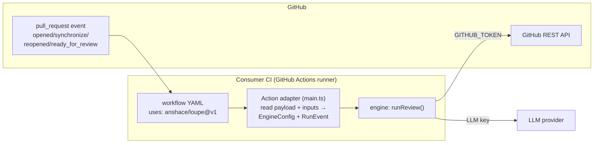
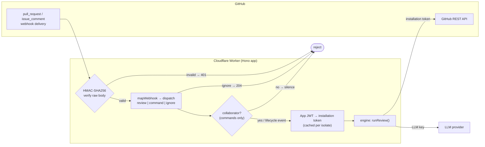

# Loupe — Architecture Reference

> A thorough, code-accurate reference for how Loupe is built. For a narrative,
> tutorial-style walkthrough see [`../guides/01-how-it-works.md`](../guides/01-how-it-works.md);
> for the *why* behind each decision see the OpenSpec
> [`design.md`](../openspec/changes/build-pr-review-agent/design.md). This
> document is the deep structural map — packages, modules, the pipeline as it
> actually runs, delivery modes, and the core data shapes.

---

## 1. System overview

**Loupe is an AI pull-request review agent** in the spirit of CodeRabbit, Qodo
Merge (PR-Agent), and Greptile. When a PR is opened or updated on GitHub, Loupe
fetches the diff plus relevant repo context, has an LLM review it, and posts
**inline review comments plus one upserted summary comment** back on the PR. It
is a solo, learning-first project built OpenSpec-first, free-tier-first, and
developed/tested entirely locally.

The whole design rests on four load-bearing ideas:

### Trigger-agnostic engine + thin adapters

The review logic lives in a **pure TypeScript library** (`packages/engine`) that
knows nothing about *how* it was invoked. Its entire contract is:

```
runReview(prIdentity, authToken, config, deps) → ReviewResult
```

Everything trigger-specific — reading a workflow payload, verifying a webhook,
minting tokens — lives in **thin adapters** around that core. Today one adapter
ships (the GitHub Action); a second is fully built but deferred (the GitHub App
on Cloudflare Workers). Both drive the *exact same* `runReview` entry point, so
the two delivery modes coexist without a rewrite. This is design decision 1 and
the single most important structural choice in the project.

### "LLM proposes, code disposes"

The model **only ever emits structured JSON** — a findings array, or (in agentic
mode) tool-call requests the engine executes on its behalf. Every scoring,
suppression, dedupe, anchoring, and *every GitHub mutation* is deterministic
code. **The model never holds a write credential and never executes anything
itself.** This structurally caps the blast radius of any prompt injection hidden
in a diff, description, or comment (design decision 8).

### Reviewer + verifier, two roles

One LLM pass *finds* issues (the reviewer). An optional second, independent pass
*tries to kill* them (the verifier) — and can only do so with cited `file:line`
evidence and a closed-enum drop reason; otherwise the finding survives
(fail-open). This is the highest-leverage mechanism the research corpus
identified against false positives, the #1 reason AI reviewers get uninstalled
(design decision 9).

### Everything is deterministic, capped, and disclosed

Noise filters, size caps, secret/supply-chain scans, and line anchoring are pure
functions. Agentic tool loops, token spend, and context size are all
hard-capped. And a run **never silently drops a finding** — every finding ends
up either published, in the review body, in the summary, or in an explicit
suppression / dedupe / verifier-drop record (the run.ts invariant).

---

## 2. Package & module map

### Packages (monorepo)

| Package | Role | Notes |
|---|---|---|
| **`packages/engine`** | The whole review pipeline. Pure TypeScript, **zero runtime dependencies**, trigger-agnostic. | Entry point: `runReview()` in `run.ts`. Never imports `@actions/*` or any webhook framework. |
| **`packages/action`** | GitHub Action adapter (**shipping**). | Reads the `pull_request` event + action inputs, maps them to `EngineConfig`, drives `runReview`, posts via `GITHUB_TOKEN`. Uses `@actions/core` + `@actions/github`. |
| **`packages/worker`** | GitHub App adapter — a Hono app for Cloudflare Workers (**built, deferred**). | HMAC webhook verification, event routing, App→installation-token minting, `/review` + `/ask` slash commands. Same engine underneath. |
| **`packages/scope-ts`** | Optional tree-sitter (wasm) implementation of the enclosing-scope expander. | Swaps in for the engine's dependency-free regex heuristic via `RunDeps.scopeExpander`, for fs-capable paths. |
| **`packages/rag`** | Optional embeddings-RAG experiment (M5). | `InMemoryRetriever` + a deterministic `HashEmbedder`, wired through the engine's `Retriever` seam. Off by default; sqlite-vec documented as the native upgrade. |

Supporting directories: `prompts/` (versioned markdown prompt files — `reviewer-v1..v7.md`, `verifier-v1..v2.md`), `evals/` (offline eval harness), `openspec/` (source of truth), `research/` (design corpus), `guides/` (human-facing narrative), `docs/` (Ansh's personal notes).

### Key engine modules (`packages/engine/src`)

| Module | Responsibility (one line) |
|---|---|
| `run.ts` | The orchestrator — `runReview()` wires every stage in order; its header comment is the canonical pipeline. |
| `types.ts` | Core shared types: `Finding`, `EngineConfig`, `ReviewResult`, `PrIdentity`, `RunEvent`, verification records. |
| `diff.ts` | Fetch the unified diff (PR or compare) and parse it into files → hunks with valid new-side line numbers. |
| `noise.ts` | Filter lockfiles / generated / vendored / binary files before anything reaches the model. |
| `sizeCap.ts` | Deterministic diff size caps with explicit, never-silent exclusion records. |
| `gate.ts` | `shouldRun` — skip draft PRs, self-generated (bot-actor) events, already-reviewed SHAs. |
| `config.ts` | Load & parse `.aireview.toml` (minimal zero-dep TOML subset), `globMatch`, `fetchRepoFile`. |
| `scope.ts` | Enclosing-function/class expansion around hunks — regex/brace (TS/JS) + indent (Python) heuristic; `ScopeExpander` interface. |
| `importgraph.ts` | Cross-file recall: reverse-import scan (`find_importers`) + deterministic signature-change caller injection. |
| `secrets.ts` | Deterministic secret/credential pre-pass over added lines (regex + Shannon entropy), value redacted. |
| `workflowcheck.ts` | Deterministic GitHub Actions supply-chain checks (unpinned actions, pwn-request, script injection). |
| `intent.ts` | Fetch PR title/body + linked issues (one REST call) → `{{PR_INTENT}}` block. |
| `prompt.ts` | Load & render versioned prompt templates; build the per-language security checklist and commentable-line list. |
| `model.ts` | Unified LLM provider layer — OpenAI-compatible / Anthropic / Gemini + `MockProvider`; `buildProvider`. |
| `escalate.ts` | Risky-path heuristic (`auth/payment/billing/migrat/crypt/secret`) and the Sonnet escalation target. |
| `cost.ts` | `CostTracker` (real token counts), per-run token caps, monthly USD budget ledger + degrade check. |
| `agentic.ts` | Capped agentic tool loop — `grep` / `read_file` / `find_importers` executed read-only on the model's behalf. |
| `guardrail.ts` | Defensive JSON parse of findings *and* tool-call requests — never throws, degrades gracefully. |
| `verify.ts` | Verifier pass: keep/rewrite/drop with evidence, closed drop-reason enum, deterministic quote grounding. |
| `suppress.ts` | Do-not-report list + `HOUSE_RULES.md` `suppress:` rules + min-severity filter (every drop recorded). |
| `clamp.ts` | Anchoring chain: exact line → nearest commentable line → file-level → summary mention. |
| `dedupe.ts` | Stateless dedupe vs existing bot comments + intra-run near-duplicate grouping; fetch existing comments. |
| `publish.ts` | Build the single batched `POST /pulls/{n}/reviews` payload; render committable `suggestion` blocks. |
| `summary.ts` | Compose & upsert the ONE summary comment (hidden marker + embedded state SHA + risk verdict + table). |
| `state.ts` | Durable `PrState` (`KvStateStore` / `FileStateStore`), hunk hashing, still-open carry-forward. |
| `incremental.ts` | `decideScope` (before..after vs full), compare-diff fetch, already-reviewed hunk dropping. |
| `runlog.ts` | Append one JSONL record per run (model, tokens, cost, findings kept/dropped, drop-reason histogram). |
| `retrieve.ts` | The `Retriever` seam + `{{RETRIEVED_CONTEXT}}` rendering for the optional RAG experiment. |
| `stats.ts` | M0 helper — the static "review bot was here" stats comment. |

---

## 3. The review pipeline (as implemented in `run.ts`)

The entire pipeline is one function, `runReview()`. Its stages run in this exact
order. The overriding invariant (task 4.2): **no finding is ever silently
dropped** — everything lands in the payload, review body, summary, or an
explicit suppression/dedupe/verifier-drop record.

**Deterministic pre-passes & context assembly**

1. **Fetch existing bot comments** (`dedupe.ts`) — this is both the stateless
   dedupe corpus *and* the fallback source of the last-reviewed SHA (read from a
   hidden marker in the summary comment).
2. **Load durable state** (`state.ts`) — if a `StateStore` is configured, read
   `{lastReviewedSha, hunkHashes, openFindings}`. Store SHA wins; summary-marker
   SHA is the fallback. State reads never crash the run.
3. **Gate** (`gate.ts`) — stop on draft PRs, bot-actor (self) events, or a head
   SHA already reviewed (unless `onDemand`, i.e. `/review`).
4. **Load repo config** (`config.ts`) — `.aireview.toml` + `HOUSE_RULES.md` from
   the PR head. Missing → safe defaults, no notice. Malformed → safe defaults +
   a visible summary notice, never a crash. `enabled = false` ends the run
   before any model call.
5. **Decide scope** (`incremental.ts`) — with a prior review and a `before` SHA,
   fetch only the `base..head` compare diff; otherwise the full PR diff.
6. **Parse the diff** (`diff.ts`) into files → hunks. The pre-skip parse
   (`changedFiles`) is retained as the coordinate system for carry-forward.
7. **Drop already-reviewed hunks** (`incremental.ts`) — content-hash match
   against prior state (never on `onDemand`).
8. **Ignore globs → noise filter → size cap** — `.aireview.toml` ignore globs,
   then lockfile/generated/vendored/binary filtering (`noise.ts`), then a
   deterministic size cap with never-silent exclusion records (`sizeCap.ts`).
9. **Select the provider** (`model.ts` + `cost.ts` + `escalate.ts`) — env/config
   choice, degraded to the free tier if over the monthly budget, or escalated to
   a stronger model if any changed path is risky.

**Model passes (only when there is something reviewable)**

10. **Build context** — enclosing-scope expansion around each hunk's added lines
    (`scope.ts`, capped in chars); optional forced cross-file caller injection
    (`importgraph.ts`); a grounding source snapshot for the verifier; PR intent
    (`intent.ts`, default ON); a per-language security checklist; applicable
    custom rules; optional retrieved RAG context.
11. **Reviewer LLM call** (`agentic.ts` → `model.ts`) — one call using the
    current versioned prompt, with severity rubric, do-not-report list, and valid
    commentable line ranges injected; optionally a capped grep/read/find_importers
    tool loop sharing one per-run cost budget.
12. **Output guardrail** (`guardrail.ts`) — defensively parse the JSON: tolerate
    alternate keys and bare lists, drop individually malformed findings, degrade
    to summary-only on fully unparseable output. Never throws.
13. **Verifier pass** (`verify.ts`, optional, default OFF, **fail-open**) — a
    second tool-equipped call keeps/rewrites/drops each finding with cited
    evidence + a closed drop-reason enum. A dropped finding whose cited quote is
    *not* found in the payload (a fabricated citation) is demoted back to a keep.
    Unparseable verifier output keeps everything and flags the run degraded.

**Deterministic security pre-passes (merged after the model block)**

14. **Secret scan + workflow supply-chain checks** (`secrets.ts`,
    `workflowcheck.ts`) run over *added* diff lines only, skip the LLM entirely,
    and are merged **after** the model block — so a leaked key or unpinned action
    is still flagged even when the model call failed (degraded) or stopped early.

**Disposition & publish**

15. **Suppression** (`suppress.ts`) — ignored-glob files, do-not-report
    categories, `HOUSE_RULES.md` `suppress:` rules, and the min-severity floor.
    Every drop is recorded with a reason.
16. **Anchoring chain** (`clamp.ts`) — exact line → nearest commentable line
    (≤50 away) → file-level → summary mention. Every finding gets a placement.
17. **Stateless dedupe** (`dedupe.ts`) — skip findings already matching an
    existing bot comment; then collapse intra-run near-duplicates into one
    representative with an "Also found in:" list.
18. **Severity-first ordering** — stable sort critical → nit for both inline
    comments and the summary table.
19. **Still-open carry-forward** (`state.ts`, incremental only) — persisted open
    findings whose code the new range didn't touch stay "still open" (summary
    only); touched/deleted code is assumed resolved.
20. **Publish** (`publish.ts`, `summary.ts`) — unless `dryRun`: exactly ONE
    batched review (`POST /pulls/{n}/reviews`, body + inline comments) and ONE
    upserted summary comment (PATCH the marker comment in place, or POST if
    absent).

**Persist**

21. **Ledger + state + run log** — record monthly spend (`cost.ts`), persist new
    `PrState` (SHA + cumulative hunk hashes + open findings, `state.ts`), and
    append one JSONL run-log record (`runlog.ts`). All best-effort, never on
    `dryRun`, never fatal.

> **Shared cost budget:** the reviewer, verifier, and agentic hops all draw from
> **one** per-run `CostTracker`. When a cap would be exceeded, verifier/agentic
> work is *skipped with a disclosed notice* — never a hard failure (task 6.6).

### Pipeline flowchart

```mermaid
flowchart TD
    START(["runReview(pr, auth, config, deps)"]) --> EXIST["Fetch existing bot comments<br/>dedupe corpus + summary-marker SHA"]
    EXIST --> STATE1["Load durable state<br/>lastReviewedSha, hunkHashes, openFindings"]
    STATE1 --> GATE{"Gate<br/>draft? self-actor?<br/>SHA already reviewed?"}
    GATE -- "skip" --> EMPTY(["empty result + reason"])
    GATE -- "run" --> CFG["Load .aireview.toml + HOUSE_RULES.md<br/>(from PR head)"]
    CFG --> DIS{"enabled = false?"}
    DIS -- "yes" --> EMPTY
    DIS -- "no" --> SCOPE["Decide scope<br/>incremental before..after vs full"]
    SCOPE --> PARSE["Fetch + parse diff → files/hunks"]
    PARSE --> HUNKSKIP["Drop already-reviewed hunks<br/>(content-hash match)"]
    HUNKSKIP --> FILTER["Ignore globs → noise filter → size cap"]
    FILTER --> PROV["Select provider<br/>budget degrade / risk escalation"]
    PROV --> REVIEWABLE{"anything<br/>reviewable?"}

    REVIEWABLE -- "no" --> DET
    REVIEWABLE -- "yes" --> CTX["Build context<br/>enclosing scope · cross-file callers<br/>PR intent · security checklist<br/>custom rules · optional RAG"]
    CTX --> REV["Reviewer LLM call<br/>versioned prompt + line ranges<br/>optional capped agentic tools"]
    REV --> GUARD["Output guardrail<br/>defensive JSON parse"]
    GUARD --> VER{"verifier on?<br/>(fail-open)"}
    VER -- "yes" --> VERIFY["Verifier pass<br/>keep/rewrite/drop + evidence<br/>+ quote grounding"]
    VER -- "no" --> DET
    VERIFY --> DET["Deterministic security pre-passes<br/>secret scan + workflow checks<br/>(merged AFTER model block)"]

    DET --> SUP["Suppression<br/>ignored-glob · do-not-report<br/>house rules · min severity"]
    SUP --> ANCHOR["Anchoring chain<br/>line → nearest → file → summary"]
    ANCHOR --> DEDUPE["Stateless dedupe<br/>+ near-duplicate grouping"]
    DEDUPE --> SORT["Severity-first sort"]
    SORT --> CARRY["Still-open carry-forward<br/>(incremental only)"]
    CARRY --> POST["Publish (unless dryRun)<br/>1 batched review + 1 upserted summary"]
    POST --> PERSIST["Persist: spend ledger<br/>+ PrState + JSONL run log"]
    PERSIST --> DONE(["ReviewResult"])
```



---

## 4. Delivery modes

Both modes are thin adapters over the identical engine. What differs is the
trigger, the auth model, and the hosting.

### Mode B — GitHub Action (shipping)

The engine runs inside the **consumer's own CI**, invoked from a workflow file,
using their `GITHUB_TOKEN` and their own LLM key. Zero hosting, zero webhook
security surface, each user pays their own LLM bill.

- **Adapter:** `packages/action/src/main.ts` (+ `payload.ts`).
- **Auth:** the workflow `GITHUB_TOKEN` (or the `github-token` input). Bot
  identity is `github-actions[bot]` for self-event skipping. No token minting.
- **State (optional):** `FileStateStore` pointed at a persisted path (e.g. an
  `actions/cache` location) enables incremental re-review + carry-forward.
- **Provider:** the `provider` input (unified scheme) or the `review-model`
  back-compat shortcut; the engine owns construction, budget degrade, escalation.



### Mode A — GitHub App on Cloudflare Workers (built, deferred)

One App Ansh registers, one hosted webhook server. Users click **Install** — no
workflow file, no per-repo wiring. Per-installation tokens, slash commands on any
installed repo. Fully built and unit-tested; **not deployed** (deploying means
funding every user's LLM calls from one key).

- **Adapter:** `packages/worker` — Hono app (`app.ts`), pure routing (`route.ts`),
  handlers (`handlers.ts`), signature verify (`verify.ts`), App auth (`appAuth.ts`).
- **Auth (two layers):**
  1. **Inbound — HMAC-SHA256 webhook verification** over the *raw* body against
     `X-Hub-Signature-256`, done via WebCrypto `crypto.subtle.verify` (built-in
     constant-time compare) **before any `JSON.parse`**. Missing/forged → 401.
  2. **Outbound — App JWT → installation token.** `appAuth.ts` mints a short-lived
     RS256 App JWT (PKCS#8 via WebCrypto), exchanges it for a per-installation
     access token, and caches it per isolate (refresh when < 5 min remain).
- **Slash commands:** `/review` and `/ask`, **gated to collaborators with write
  access** (non-collaborators are ignored completely — no run, no comment, no
  reaction). A 👀 reaction acks the command before work begins.
- **Delivery timing:** the webhook ACKs 202 immediately and continues review work
  via `executionCtx.waitUntil` (GitHub's ~10s delivery window vs a longer review).
- **State (optional):** `KvStateStore` over a Cloudflare KV binding.



---

## 5. LLM provider abstraction

The engine talks to models through one tiny interface (`model.ts`) — no SDK
dependencies, just injectable `fetch`:

```ts
interface ReviewModel {
  name: string;
  complete(req: { system, user }): Promise<{ text, inputTokens, outputTokens }>;
}
```

**"provider" means the wire PROTOCOL, not the vendor.** Three protocols cover
essentially every hosted or local model, plus a `MockProvider` for tests:

| Protocol | Endpoint shape | Covers | Notes |
|---|---|---|---|
| `openai` | `${baseUrl}/chat/completions` | OpenAI, OpenRouter, Groq, DeepSeek, Together, Ollama, any OpenAI-compatible server | `baseUrl` is a preset keyword or a full URL; **requires an explicit `model`**. |
| `anthropic` | `${baseUrl}/v1/messages` | Anthropic + any compatible endpoint | System block gets `cache_control: ephemeral` → prompt caching. Default `claude-haiku-4-5`. |
| `gemini` | Google AI Studio `generateContent` | Gemini | The free-tier / budget-degrade default (`gemini-2.5-flash`). |

- **Configurable base-url + model:** `EngineConfig.provider` / `model` / `baseUrl`
  / `apiKey` drive `buildProvider`. API-key resolution is `explicit → LLM_API_KEY
  → provider-specific env var`. A back-compat `REVIEW_MODEL` shortcut
  (`gemini | haiku | groq`) still works when `provider` is unset.
- **Real token counts** are read from each provider's usage fields (never char
  estimates) — including Anthropic cache-read/write tokens summed into input.
- **Escalation** (`escalate.ts`): when a changed path matches
  `auth/payment/billing/migrat/crypt/secret`, the run rebuilds the *same*
  provider/base-url/key with a stronger model. The `anthropic` protocol (and the
  `haiku` shortcut) default to `claude-sonnet-5`; other endpoints escalate only
  when `escalationModel` is set (Loupe won't guess an upgrade for an arbitrary
  endpoint).
- **Cost caps / budget degrade** (`cost.ts`): a per-run **token cap** enforced
  with real counts (mid-run exhaustion → publish what exists + an early-stop
  notice), and an optional monthly **USD budget** backed by a flat-JSON ledger.
  Over budget → the run degrades to the free-tier `gemini` provider. A budget
  breach outranks a risk escalation. Unknown models cost `$0` (mock/arbitrary
  endpoints don't accrue against the USD budget; the token cap still applies).

---

## 6. Context & recall strategy

Loupe's stance (design decision 5): **agentic search over embeddings-RAG** —
right context beats more context, with zero index infra. Context is assembled in
layers, each capped and disclosed:

- **Noise filter** (`noise.ts`) — lockfiles, generated (`.min.js`, `.map`,
  `.pb.go`, `_pb2.py`, `dist/`, `build/`, …), vendored (`node_modules/`,
  `vendor/`, …), and binary files never reach the model.
- **Size caps** (`sizeCap.ts`) — deterministic total/per-file char & line caps;
  every exclusion is recorded and surfaced in the summary (never silent
  truncation).
- **Enclosing-scope expansion** (`scope.ts`) — each hunk's added lines expand to
  the surrounding function/class. The default `RegexScopeExpander` is a
  dependency-free brace heuristic (TS/JS) + indent heuristic (Python) so it runs
  on the Workers path; `packages/scope-ts` provides a tree-sitter (wasm)
  implementation of the same `ScopeExpander` interface, injected via
  `RunDeps.scopeExpander`. Misses return `undefined` — never an error.
- **Capped agentic tools** (`agentic.ts`) — off by default; when on, the model
  may request `grep`, `read_file`, or `find_importers`, which the engine executes
  **read-only** on its behalf under hard caps (default 5 hops, 10 file reads,
  200 KB total). Cap exhaustion forces a findings answer. Reviewer and verifier
  share **one** usage budget.
- **Reverse-import caller injection** (`importgraph.ts`) — deterministically
  detects when the diff changes an *exported* signature and **force-injects** its
  call sites from other files into the prompt, so an un-updated caller is
  surfaced even if the model wouldn't grep for it. Opt-in (whole-repo scan),
  capped, fail-soft.
- **PR intent** (`intent.ts`) — title/body + closing-keyword-linked issues, one
  REST call, default ON, fail-soft — so the model can judge the diff against what
  the author says it does.
- **Per-language security checklist** (`prompt.ts`) — curated CWE / input-validation
  lines appended for the languages present in the diff.
- **Optional RAG** (`retrieve.ts` + `packages/rag`) — a `Retriever` seam injects
  clearly-labeled `{{RETRIEVED_CONTEXT}}` (reference material, never
  instructions). Default OFF — the M5 experiment, not core architecture.

---

## 7. State & incrementality

Loupe is **stateless by default** (design decision 6). The core loop is a pure
transform: event → diff → LLM → comment. Dedupe and idempotency work by reading
the PR's own comments.

- **The summary marker** (`summary.ts`) — exactly one summary issue comment per
  PR, identified by a hidden HTML marker `<!-- ai-review-bot:summary -->`, edited
  in place on every run. It also carries a machine-readable state marker
  embedding the last-reviewed SHA, which the gate reads back on the next event.
  This is the *only* state source when no store is configured.
- **The M5 state store** (`state.ts`) — an optional durable upgrade behind a
  `StateStore` interface: `KvStateStore` (Cloudflare KV, App path) or
  `FileStateStore` (a flat JSON file, Action path). It persists
  `PrState = {lastReviewedSha, hunkHashes, openFindings}` and unlocks two things
  the marker alone can't: hunk-hash skipping and carry-forward.
- **Incremental re-review** (`incremental.ts`) — on `synchronize`, with a prior
  review and a `before` SHA, only the `base..head` compare diff is fetched (base =
  last *reviewed* SHA when known, so gate-skipped pushes are still covered).
- **Hunk hashing** (`state.ts`) — content hash of `path + line types/contents`
  (FNV-1a; line *numbers* excluded, so a hunk that merely shifted is still
  recognized as already reviewed). `dropReviewedHunks` removes hunks whose hash
  is already in state.
- **Still-open carry-forward** (`state.ts`) — on an incremental run, persisted
  open findings whose code the new range didn't touch stay "still open" in the
  summary (never re-posted inline); touched or deleted code is assumed resolved.
  Bounded (`MAX_TRACKED_HUNK_HASHES`, `MAX_OPEN_FINDINGS`) so long-lived PRs
  can't grow state without limit.

---

## 8. Security posture

- **No write creds to the model.** "LLM proposes, code disposes" — the model
  emits JSON only; all GitHub mutations are deterministic code. The model never
  holds a token and never executes anything (agentic tools run read-only,
  engine-side).
- **No clone/execute of PR code.** Loupe only reads via the GitHub API — it never
  checks out and runs untrusted PR code, sidestepping the entire
  `pull_request_target` "pwn-request" class.
- **HMAC webhook verification (App path).** HMAC-SHA256 over the raw body against
  `X-Hub-Signature-256`, verified with WebCrypto's constant-time
  `crypto.subtle.verify` **before any parsing**. Missing/malformed/forged → 401,
  and nothing downstream runs.
- **Installation tokens are server-side and short-lived** (`appAuth.ts`) — minted
  from an RS256 App JWT, cached per isolate, refreshed near expiry; never exposed
  to the model.
- **Deterministic security pre-passes** run regardless of the model:
  - **Secret scan** (`secrets.ts`) — named credential formats (AWS, GitHub,
    Slack, Stripe, Google, PEM, JWT) plus a generic entropy-gated
    "secret-shaped assignment" detector, over *added* lines only. Placeholders /
    `EXAMPLE` values / interpolations are rejected; a per-repo allowlist
    (`secret_allow_paths` / `secret_allow_patterns`) silences known-safe matches;
    the matched value is redacted in the finding.
  - **Workflow supply-chain checks** (`workflowcheck.ts`) — unpinned third-party
    actions (tag/branch instead of a commit SHA; first-party `actions/*` &
    `github/*` trusted), `pull_request_target` + PR-head checkout, and untrusted
    `${{ github.event.* }}` interpolated into a `run:` script.
- **Prompt-injection containment** — the model's lack of write access is the
  structural cap; on top of that: slash commands are collaborator-gated, findings
  are schema-validated before any API call, and the `/ask` system prompt
  explicitly instructs the model to ignore any instructions appearing inside the
  diff.

---

## 9. Core data shapes

Conceptual view of the central types (`types.ts`), the contract between stages
and adapters.

| Type | Shape (conceptual) | Purpose |
|---|---|---|
| **`Finding`** | `severity` (`critical..nit`), `category`, `file`, `line?`, `title`, `body`, `suggestion?`, `suggestedLine?` | The unit of review output. Absent `line` = file-level. `suggestedLine` enables a committable one-click `suggestion` block. |
| **`PrIdentity`** | `{ owner, repo, prNumber }` | Which PR to review — independent of how the run was triggered. |
| **`AuthToken`** | `string` | An installation or workflow token. The engine never mints or stores one. |
| **`RunEvent`** | `{ isDraft?, actor?, headSha?, onDemand?, before? }` | Event-shaped gate inputs supplied by the adapter. `before` drives incremental scope. |
| **`EngineConfig`** | provider/model/baseUrl/apiKey, `escalationModel`, `minSeverity`, `event`, caps, feature flags (`agentic`, `verify`, `escalation`, `rag`, `prIntent`, `crossFileCallers`), paths (`ledgerPath`, `runLogPath`, `configPath`, `promptPath`), `dryRun`, `botIdentity` | The full run configuration; most features default OFF until proven. |
| **`PrIntent`** | `{ title?, body?, linkedIssues[] }` | The PR's stated intent, injected as `{{PR_INTENT}}`. |
| **`DropReason`** | `false-claim` / `pre-existing` / `repo-convention` / `out-of-scope` / `theoretically-impossible` / `insufficient-context` | Closed enum a verifier drop must cite (`insufficient-context` = abstention). |
| **`DroppedFinding`** / **`UngroundedVerdict`** / **`VerificationRecord`** | finding + reason + evidence / finding + flagged grounding failure / the whole verifier outcome | Verifier bookkeeping — drops and grounding failures are disclosed, never silent. |
| **`PrState`** | `{ lastReviewedSha, hunkHashes[], openFindings[] }` | Durable per-PR state for incrementality + carry-forward. |
| **`ReviewPayload`** | `{ body, event: "COMMENT", comments[] }` | The single batched `POST /pulls/{n}/reviews`. |
| **`ReviewResult`** | findings, summary, skippedFiles, exclusions, degraded, payload, posted, usage, suppressed, deduped, stillOpen, incremental, summaryFindings, notices, earlyStop, summaryComment, verification, agenticUsage | The complete, inspectable outcome of a run — the adapter's return value and the basis of every test assertion. |

---

## 10. Cross-references

**Source of truth (OpenSpec):**
- [`../openspec/changes/build-pr-review-agent/proposal.md`](../openspec/changes/build-pr-review-agent/proposal.md) — why & what.
- [`../openspec/changes/build-pr-review-agent/design.md`](../openspec/changes/build-pr-review-agent/design.md) — the decision table (referenced throughout as "design decision N"), milestone plan, risks.
- Capability specs: [`../openspec/changes/build-pr-review-agent/specs/`](../openspec/changes/build-pr-review-agent/specs/) — `pr-trigger`, `review-pipeline`, `review-publishing`, `repo-configuration`.

**Companion documentation (this folder):**
- [`./adr/`](./adr/) — architecture decision records (companion to design.md's decision table).
- [`./planning.md`](./planning.md) — milestone/roadmap planning.

**Research corpus:**
- [`../research/08-synthesis-architecture-and-milestones.md`](../research/08-synthesis-architecture-and-milestones.md) — the architecture diagram, pipeline, decision rationale, milestone roadmap, cost model.
- [`../research/10-feature-improvements.md`](../research/10-feature-improvements.md) — the ranked feature roadmap the precision/security/recall/actionability work items came from.

**Guides (narrative / reference):**
- [`../guides/01-how-it-works.md`](../guides/01-how-it-works.md) — deeper narrative walkthrough + current status.
- [`../guides/02-plan-b-open-source-action.md`](../guides/02-plan-b-open-source-action.md) — the shipping Action mode.
- [`../guides/03-future-github-app.md`](../guides/03-future-github-app.md) — the deferred App mode.
- [`../guides/04-how-to-run-and-test.md`](../guides/04-how-to-run-and-test.md) — running & the live-verification checklist.
