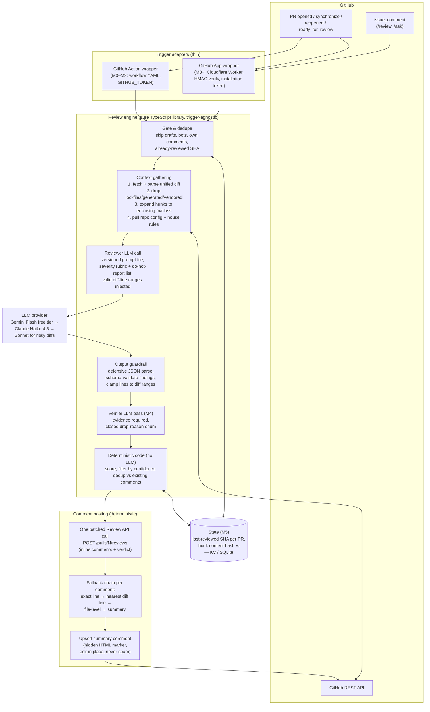

# 01 — How It Works

A report-for-the-future: what this project is, how the code is laid out, what
the pipeline actually does step by step, and where the project stands today.

See also: [`02-plan-b-open-source-action.md`](./02-plan-b-open-source-action.md)
(the mode shipping now), [`03-future-github-app.md`](./03-future-github-app.md)
(the mode deferred to later), [`04-how-to-run-and-test.md`](./04-how-to-run-and-test.md)
(how to actually run and verify it).

## What this is

An AI pull-request review agent, in the spirit of CodeRabbit, Qodo Merge
(PR-Agent), and Greptile: when a PR is opened or updated on GitHub, it fetches
the diff plus relevant repo context, has an LLM review it, and posts inline
review comments plus one upserted summary comment back on the PR. It's a
solo, learning-first project by Ansh Roshan — spec-driven through
`openspec/`, free-tier-first, everything developed and tested locally.

Source of truth for *why* and *what*:
[`openspec/changes/build-pr-review-agent/proposal.md`](../openspec/changes/build-pr-review-agent/proposal.md)
and
[`design.md`](../openspec/changes/build-pr-review-agent/design.md).
Source of truth for the *architecture*:
[`research/08-synthesis-architecture-and-milestones.md`](../research/08-synthesis-architecture-and-milestones.md).

## Repo / package map

| Path | Purpose |
|---|---|
| `packages/engine` | The whole review pipeline. Pure TypeScript, **zero runtime dependencies**, trigger-agnostic — it knows nothing about Actions or webhooks, only `(PR identity, auth token, config)`. |
| `packages/action` | GitHub Action adapter: reads the `pull_request` event payload, calls the engine, lets the engine post via `GITHUB_TOKEN`. See guide 02. |
| `packages/worker` | Hono app targeting Cloudflare Workers — the GitHub App adapter: HMAC webhook verification, event routing, installation-token minting, slash commands (`/review`, `/ask`). Built and tested, **not deployed**. See guide 03. |
| `packages/scope-ts` | Optional tree-sitter (wasm) implementation of the enclosing-scope expander, for fs-capable execution paths — swaps in for the engine's dependency-free regex heuristic via `RunDeps.scopeExpander`. |
| `packages/rag` | Optional embeddings-RAG experiment (M5): `InMemoryRetriever` + a deterministic `HashEmbedder`, wired through the engine's `Retriever` seam. Off by default. |
| `prompts/` | Versioned markdown prompt files — the only place model instructions live (`reviewer-v1.md` … `reviewer-v4.md` current default, `verifier-v1.md`). Never edited in place once shipped; a change ships as a new version file. |
| `evals/` | Offline eval harness: 23 seeded dummy-PR cases (`evals/cases/*.mjs`) run through the real pipeline against a canned/replay mock provider, scored for found/missed/unexpected findings. |
| `openspec/` | Source of truth for the change: proposal, design, tasks. |
| `research/` | Research corpus (01–09) the design was derived from. |
| `docs/` | Ansh's personal implementation notes (state model, house rules, App setup checklist). |
| `guides/` | This folder — narrative guides for humans (and future-Claude). |

## The review pipeline, stage by stage

The whole pipeline lives in one function, `runReview()` in
[`packages/engine/src/run.ts`](../packages/engine/src/run.ts), whose header
comment is the canonical order of operations. In words:

1. **Fetch existing bot comments** — read via the API first; this is both the
   stateless dedupe corpus and (absent a durable store) the fallback source of
   the last-reviewed SHA, read from the hidden marker in the summary comment.
2. **Load durable state (M5)** — if a `StateStore` is configured
   (`FileStateStore` on the Action path, `KvStateStore` on the Worker path),
   read `{lastReviewedSha, hunkHashes, openFindings}` for this PR.
3. **Gate** (`gate.ts`) — skip draft PRs, skip events whose actor is the bot
   itself, skip when the head SHA already matches the last reviewed SHA
   (unless the request is explicitly on-demand, e.g. `/review`).
4. **Load repo config** — `.aireview.toml` and `HOUSE_RULES.md` from the PR
   head via the contents API. Missing file → safe defaults, no notice.
   Malformed file → safe defaults **and** a visible summary notice, never a
   crash. A disabled repo (`enabled = false`) ends the run before any model
   call.
5. **Decide scope** (`incremental.ts`) — if there's a prior review and the
   event carries a `before` SHA, fetch only the `before..after` compare diff
   instead of the whole PR; otherwise fetch the full PR diff.
6. **Parse the diff** into files → hunks with valid new-side line numbers
   (`diff.ts`), and drop hunks whose content hash already appears in the
   prior state's `hunkHashes` (already reviewed, even if merely shifted).
7. **Ignore globs → noise filter → size cap** — `.aireview.toml` ignore
   globs, then lockfile/generated/vendored/binary filtering (`noise.ts`), then
   a deterministic size cap with an explicit, never-silent exclusion record
   (`sizeCap.ts`).
8. **Select the LLM provider** — env/config choice (Gemini free tier / Claude
   Haiku 4.5 / Groq), degraded to the free tier if the monthly budget ledger
   is over budget, or escalated to Claude Sonnet 5 if any changed path looks
   risky (`auth`, `payment`, `billing`, `migrat(ion)`, `crypt`, `secret` —
   `escalate.ts`).
9. **Build context** — enclosing-function/class expansion around each hunk's
   added lines (regex/brace-and-indent heuristic by default, tree-sitter via
   `packages/scope-ts` if injected — `scope.ts`), capped in total characters;
   optionally, retrieved RAG context (off by default); path-scoped custom
   rules from `.aireview.toml` injected as `{{CUSTOM_RULES}}`.
10. **Reviewer LLM call** — one call using the current versioned prompt
    (`reviewer-v4.md`), with the severity rubric, do-not-report list, valid
    commentable line ranges, and (optionally) a capped agentic grep/read tool
    loop for cross-file lookups (`agentic.ts`, hard caps on hops/reads/bytes,
    shared cost budget with the verifier).
11. **JSON guardrail** (`guardrail.ts`) — defensively parse the model's
    output: tolerate alternate key names and bare lists, drop individually
    malformed findings while keeping the rest, degrade to a summary-only run
    on fully unparseable output. Never crashes on bad model output.
12. **Verifier pass (optional, default off)** — a second, tool-equipped LLM
    call (`verify.ts`, `verifier-v1.md`) that must keep / rewrite / drop each
    finding with cited `file:line` evidence and a closed drop-reason enum
    (`false-claim` / `pre-existing` / `repo-convention` / `out-of-scope` /
    `theoretically-impossible`). **Fails open**: any finding without both a
    valid reason and evidence is kept; fully unparseable verifier output keeps
    everything and flags the run as degraded.
13. **Suppression** (`suppress.ts`) — do-not-report categories, `HOUSE_RULES.md`
    `suppress:` substring rules, minimum severity threshold, ignored-glob
    files — every drop is recorded with a reason, never silent.
14. **Anchoring chain** (`clamp.ts`) — exact line → nearest commentable diff
    line (≤50 away) → file-level comment → summary mention. No finding is
    ever silently dropped for line-anchoring reasons.
15. **Stateless dedupe** (`dedupe.ts`) — skip findings that already match an
    existing bot comment (body/location), so re-reviews never spam.
16. **Still-open carry-forward (M5)** — on an incremental run, persisted open
    findings whose code the new range didn't touch are carried forward into
    a "still open" summary section (never re-posted inline); touched or
    deleted code is assumed resolved (`state.ts`).
17. **Publish** — exactly ONE batched review via
    `POST /pulls/{n}/reviews` with all inline comments plus a body (`publish.ts`),
    and ONE upserted summary comment identified by a hidden HTML marker,
    edited in place rather than reposted (`summary.ts`).
18. **Persist state + run log** — new `PrState` (SHA, cumulative hunk hashes,
    open findings) written back to the store; one JSONL record per run
    (model, tokens, cost, findings kept/dropped, drop-reason histogram,
    escalated?, incremental?) appended to the run log for self-analytics
    (`runlog.ts`).

### "LLM proposes, code disposes"

The model **only ever emits structured JSON findings** (or, in agentic mode,
tool-call requests the engine executes on its behalf — the model never
executes anything itself). Every GitHub mutation, every scoring/suppression/
dedupe/anchoring decision, is deterministic code. The model never holds write
credentials. This is design decision 8 in `design.md`, and it structurally
caps the blast radius of any prompt injection embedded in a PR's diff,
description, or comments.

### Reviewer + verifier, two roles

One LLM finds issues (the reviewer); a second, independent LLM call tries to
kill them (the verifier), and can only do so with cited evidence and a
closed-enum reason — otherwise the finding survives. This is the single
highest-leverage mechanism the research corpus identified against false
positives (the #1 reason AI reviewers get uninstalled). It's implemented but
**default OFF** in this codebase until the eval set (task 6.8, still deferred)
proves the ≥30%-correct-kill-rate bar from `design.md`.

## The two delivery modes, at a glance

- **Mode B — GitHub Action (current plan, shipping now).** The engine runs
  inside the *consumer's own* CI, invoked from a workflow file, using the
  consumer's own `GITHUB_TOKEN` and their own LLM API key. Zero hosting, zero
  webhook security surface, each user pays their own LLM bill. This is what
  Ansh is doing next. Full detail: **[guide 02](./02-plan-b-open-source-action.md)**.
- **Mode A — GitHub App on Cloudflare Workers (future, deferred).** One App
  Ansh registers, one hosted webhook server, users just click Install — no
  workflow file, no per-repo wiring, per-installation tokens, slash commands
  on any installed repo. The worker adapter is already built and tested; it
  is simply not deployed, and deploying it means Ansh funds every user's LLM
  calls from one key. Full detail: **[guide 03](./03-future-github-app.md)**.

Both modes are thin adapters around the exact same `packages/engine` library
— this is the key structural decision (design decision 1) that lets Action
and App coexist without a rewrite.

## Current status

- **M0–M5 implemented** against the milestone roadmap in `research/08` and
  `openspec/changes/build-pr-review-agent/design.md`: hello-world Action,
  single-pass review, quality/idempotency (config, house rules, dedupe,
  summary upsert), GitHub App + Worker, context depth + verifier, incremental
  re-review + custom rules + run log + optional RAG.
- **399 unit tests passing** (32 test files, `vitest run`, verified while
  writing this guide).
- **Offline eval passes**: `node evals/run.mjs` — 23 seeded dummy-PR cases
  (bugs across JS/TS/Python, cross-file signature breaks, a false-positive
  case the verifier is expected to drop, and clean PRs) run through the real
  pipeline against a canned/replay mock provider — `18/18` expected findings
  found, `0` unexpected, `1` verifier-drop, **PASS**.
- **What's NOT done yet**: only the *live-verification* tasks that need a
  real GitHub repo, a real LLM key, and a real PR — deliberately deferred to
  one final verification phase per `CLAUDE.md` and `design.md`. From
  `openspec/changes/build-pr-review-agent/tasks.md`, the still-unchecked
  items are:
  - **2.4** — M0 comment appears on a real dummy PR within ~1 min
  - **3.11** — a buggy dummy PR gets a correct inline comment; docs-only PR
    gets a clean summary; garbage LLM output doesn't crash the run
  - **4.12 / 4.13** — double-push produces zero duplicate comments and an
    edited-in-place summary; house rules suppress matching findings; broken
    `.aireview.toml` still reviews with a notice
  - **5.1 / 5.9** — register the real GitHub App; verify it reviews ≥2 repos
    with no workflow file, rejects forged webhooks, and gates slash commands
    to collaborators
  - **6.8** — verifier kills ≥30% of raw findings correctly on the eval set,
    measured against a *live* model (the offline eval above uses a replay
    mock, which validates pipeline wiring, not real model judgment)
  - **7.7 / 7.8** — incremental re-review only touches the new commit range
    on a real 50-file PR; a custom rule fires on a real violating PR; the
    RAG-on vs RAG-off comparison note gets written from live eval runs

  These map to the checklist in **[guide 04](./04-how-to-run-and-test.md)**.

## Architecture diagram

Reproduced from `research/08-synthesis-architecture-and-milestones.md` §1
(current code matches this shape):

