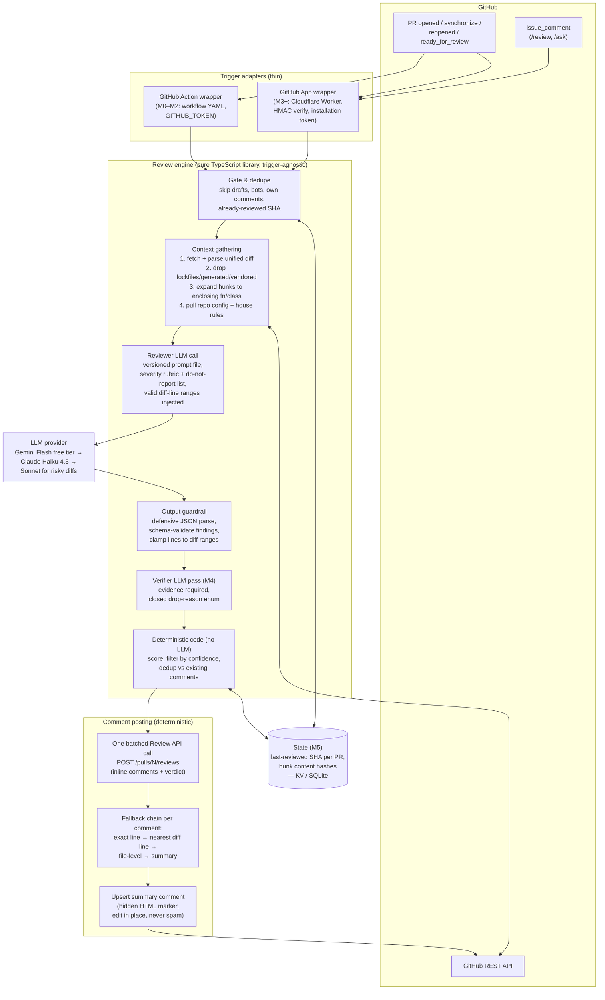

# 08 — Synthesis: Architecture & Milestones

**Audience:** Ansh (solo dev, learning-plus-real project).
**Derived from:** research files 01–07 (ClawSweeper, Magpie, PR-AF, ai-pr-review-agent, commercial landscape, GitHub mechanics, context/RAG strategies, stack/cost analysis).
**Stance:** opinionated, free-tier-first, simplest-thing-that-works. Written 2026-07-29.

---

## 1. Recommended overall architecture

**Shape: start as a GitHub Action script, graduate to a GitHub App on Cloudflare Workers.** The review *engine* is a plain TypeScript library with no knowledge of how it was triggered — the Action wrapper (M0–M2) and the App/webhook wrapper (M3+) are thin adapters around the same core. This is the single most important structural decision: it lets you ship on day one with zero infrastructure and later add the App without a rewrite.

Three design rules carried over from the strongest reference systems:

1. **LLM proposes, code disposes** (ClawSweeper, PR-AF): the model only ever emits structured JSON findings. Deterministic code does all scoring, dedup, line-mapping, formatting, and every GitHub mutation. The model never holds write credentials.
2. **Two LLM roles, not one** (Magpie, PR-AF): a *reviewer* pass that finds issues, and a *verifier/adversary* pass that tries to kill them (evidence required, closed drop-reason enum). This is the single highest-leverage mechanism against false positives — the #1 complaint about AI reviewers.
3. **Agentic search over embeddings-RAG** (research 06 consensus): grep/read/enclosing-function expansion gets ~90% of RAG quality with zero indexing infra. RAG is a M5 experiment, not a foundation.

### Architecture diagram

### Pipeline in words

1. **Trigger**: `pull_request` (opened / synchronize / reopened / ready_for_review) or a `/review` comment command. Gate: skip drafts, skip the bot's own events, skip already-reviewed SHAs.
2. **Context gathering**: fetch the unified diff via the API; parse into files → hunks with valid right-side line numbers; drop noise files (lockfiles, generated, vendored, binary); expand each hunk to the enclosing function/class (regex heuristic first, tree-sitter later); load `.aireview.toml` + house-rules file.
3. **Review**: one LLM call per manageable chunk (whole small PR, or per-file for large PRs) using a versioned prompt file with a hard severity rubric, an explicit do-not-report list, and programmatically computed valid line ranges as a constraint.
4. **Guardrail**: defensively parse the JSON (alternate key names, bare lists, per-finding failures isolated), clamp/repair line anchors, drop malformed findings — never crash the pipeline on bad model output.
5. **Verify** (M4+): a second tool-equipped pass re-reads the actual code, keeps/rewrites/drops each finding with cited evidence and a closed drop-reason enum.
6. **Post**: deterministic code dedups against existing PR comments, then submits ONE batched review (`POST /pulls/{n}/reviews`) with inline comments, plus one upserted summary comment identified by a hidden HTML marker.

---

## 2. Key architecture decisions

| Decision | Chosen option | Why | Free-tier note |
|---|---|---|---|
| **Trigger mechanism** | GitHub Action (`on: pull_request`) for M0–M2; GitHub App webhook from M3 | Action = zero infra, zero webhook security surface, ships day one on your own repos. App is the only path to Check Runs, fine-grained permissions, slash commands on any repo, and multi-repo installs — but it's a *milestone*, not a prerequisite. Engine stays trigger-agnostic so both coexist. | Actions: free unlimited on public repos; 2,000 Linux min/mo free on private — a review job is <1 min, so thousands of PRs/mo free. |
| **Hosting (App phase)** | Cloudflare Workers | Only host with a durable, no-card, genuinely-free-forever tier (100K req/day). Webhook handling is I/O-bound so the 10ms CPU limit is not a constraint. Render's cold starts (30s+) are hostile to webhook delivery windows; Railway/Fly have no real free tier anymore. | 100K req/day free — several orders of magnitude above hobby PR volume. Cloudflare KV free tier covers M5 state. |
| **Language / framework** | TypeScript everywhere. Action: plain script + `@actions/github`. Worker: Hono + Octokit | One language across both phases; Octokit gives typed API + webhook signature verification for free; Hono runs natively on Workers (Probot doesn't — it wants a long-lived Node process). Tree-sitter has good npm bindings for M4. | All open source, $0. |
| **LLM provider + model** | Dev/default: **Gemini 2.5 Flash free tier** (AI Studio). Quality default from M2: **Claude Haiku 4.5** (~$0.008/review). Escalation: **Claude Sonnet 5** for diffs touching auth/payments/migrations (path heuristic). Provider behind a thin interface. | Free tier makes iteration cost-free while you're debugging prompts (you'll burn hundreds of test reviews). Haiku is the quality/cost sweet spot for real reviews; risk-based escalation copies the PR-AF/stack-analysis tiering. Anthropic prompt caching on the stable system prompt cuts 50–90% of repeat input cost. | Gemini Flash: ~1,000 req/day free (caveat: AI Studio ToS on data use — don't point it at proprietary code). Groq Llama = free secondary fallback. Don't depend on OpenRouter `:free` models — roster is volatile. |
| **Context strategy** | Diff parse + noise filter + enclosing-function expansion; **agentic search** (grep/read tools) for cross-file lookups from M4; **no embeddings-RAG until M5, and only as an experiment** | 2026 consensus (Claude Code, Cursor, Amp all dropped vector indexes): agentic search ≈ 90% of RAG performance with zero index infra, no staleness, no embedding pipeline. Right context beats more context. | grep/read = $0. tree-sitter = $0. If RAG ever earns its keep: sqlite-vec (embedded, zero infra) first, Neon pgvector second. |
| **Storage** | **None for M0–M4** (dedupe statelessly by checking existing PR comments via API). M5: Cloudflare KV (App path) or a committed SQLite/JSON file (Action path) for `{pr → last-reviewed SHA, hunk hashes}` | The core loop is a stateless transform: event → diff → LLM → comment. Every reference project that added a DB early regretted the ops surface; ClawSweeper's ledger machinery only matters at org scale. | KV free tier and a flat file are both $0. Neon/Supabase free Postgres exists if a real relational need appears (it won't for v1). |
| **Prompts** | Versioned markdown files in-repo, never inline strings | ClawSweeper + ai-pr-review-agent pattern: diffable, reviewable, A/B-testable without code changes. | $0. |

---

## 3. Milestone roadmap

### M0 — Hello-world: a workflow that comments on a PR
- **Scope:** `.github/workflows/review.yml` on `pull_request: opened`; a ~50-line TS script that reads the event payload and posts one static "👋 review bot was here — N files, +X/−Y lines" comment via `GITHUB_TOKEN`. Test repo with dummy PRs.
- **Learning goals:** GitHub Actions event model and payload shape; `GITHUB_TOKEN` permissions block; issue-comment vs review-comment distinction (PR number == issue number).
- **Exit criteria:** opening a PR on the test repo produces a comment within ~1 min, with zero secrets beyond `GITHUB_TOKEN`. Re-running doesn't crash.

### M1 — Real single-pass review with inline comments
- **Scope:** fetch the unified diff (`Accept: application/vnd.github.diff`); parse into files/hunks with valid right-side line numbers; filter lockfiles/generated/vendored; ONE LLM call (Gemini Flash free tier) with a prompt file demanding structured JSON findings `{severity, category, file, line, title, body, suggestion?}`; defensive JSON guardrail; post one batched review via `POST /pulls/{n}/reviews` with inline comments + a summary body. Diff size cap with visible truncation marker.
- **Learning goals:** unified-diff anatomy and line-anchoring rules (`line`/`side`, why out-of-hunk lines fail); prompt→structured-output engineering; the Reviews API vs N comment calls.
- **Exit criteria:** a deliberately buggy PR gets ≥1 correct inline comment anchored to the right line; a docs-only PR gets a clean "no issues" summary; malformed LLM output never crashes the run; total run <2 min.

### M2 — Quality & idempotency: the "not annoying" milestone
- **Scope:** severity rubric + explicit do-not-report list in the prompt (Magpie's is the template); inject programmatically computed valid line ranges as a hard prompt constraint; comment-posting fallback chain (exact line → nearest diff line ≤50 away → file-level → summary); dedup against existing bot comments before posting; upsert the summary comment via hidden HTML marker; `.aireview.toml` per-repo config (severity threshold, path ignores, language) + optional `HOUSE_RULES.md`; switch default model to Claude Haiku 4.5 with prompt caching; skip drafts and self-triggered events.
- **Learning goals:** idempotency design; why AI reviewers get uninstalled (noise); config-file-driven behavior; prompt caching economics.
- **Exit criteria:** pushing twice to the same PR produces zero duplicate comments; the summary comment is edited in place, not re-posted; a rule in `HOUSE_RULES.md` ("we intentionally use X") suppresses the corresponding finding; false-positive-y nitpicks (style, "someone might later…") no longer appear.

### M3 — GitHub App + webhook server + slash commands
- **Scope:** register a GitHub App (permissions: PRs r/w, Contents read, Issues r/w, Checks r/w, Metadata); Cloudflare Worker (Hono + Octokit): raw-body HMAC-SHA256 verify with constant-time compare, event routing for `pull_request` (opened/synchronize/reopened/ready_for_review) + `issue_comment` (`/review`, `/ask`), installation-token minting with ~1h caching; 👀 reaction as command ack; commands gated to repo collaborators (anti-injection, per ClawSweeper); smee.io for local dev; same engine library underneath — the Action path keeps working.
- **Learning goals:** App vs OAuth vs PAT trust models; JWT → installation token flow; webhook signature verification; multi-repo installation model; secondary rate limits.
- **Exit criteria:** App installed on ≥2 repos reviews PRs on both with no per-repo workflow file; forged/unsigned webhook payloads are rejected 401; `/review` from a collaborator triggers a review, from a rando does nothing; Worker stays comfortably in free tier.

### M4 — Context depth + verifier pass (the review-quality milestone)
- **Scope:** enclosing-function/class expansion per hunk (regex heuristic → tree-sitter); give the reviewer optional grep/read tool access for symbol lookups (agentic search, capped hops); add the **verifier/adversary pass**: second LLM call that must keep/rewrite/drop each finding with cited `file:line` evidence and a closed drop-reason enum (false-claim / pre-existing / repo-convention / out-of-scope / theoretically-impossible); risk-based model escalation (sensitive paths → Sonnet 5); per-PR cost cap and hard loop caps.
- **Learning goals:** tree-sitter AST queries; agentic tool loops with budget caps ("without caps, adaptive systems become unbounded cost sinks" — PR-AF); two-role LLM architecture; measuring false-positive rate on a personal eval set of ~20 PRs.
- **Exit criteria:** measurable false-positive drop on the eval set (target: verifier kills ≥30% of raw findings and the kills are correct on inspection); a cross-file break (changed signature, un-updated caller) is caught at least once; no run exceeds the cost cap.

### M5 — Incremental re-reviews + RAG-assisted context + configurable rules
- **Scope:** on `synchronize`, diff only `before..after` from the payload; persist `{pr → last-reviewed SHA, hunk content-hashes}` in KV/SQLite; carry forward unresolved findings without re-emitting them; full custom-rules support in `.aireview.toml` (org rules injected into the prompt, per-path rule scoping); optional RAG experiment: sqlite-vec over house rules/ADRs/past accepted-rejected findings, injected as clearly-labeled supplementary context; simple run log (PR, model, tokens, cost, findings kept/dropped) for self-analytics.
- **Learning goals:** incremental-state design (the Copilot "re-reviews everything every push" failure mode is the anti-pattern); embeddings/chunking hands-on; evaluating whether RAG beats agentic search on your own repos (spoiler from research 06: probably not at this scale — that's a valid finding).
- **Exit criteria:** pushing a 1-line fix to a 50-file PR re-reviews only the new commit range and comments only on new/changed hunks; previously flagged, still-unfixed issues are listed as "still open" in the summary, not re-posted inline; a custom rule ("all API handlers must validate input with zod") fires correctly; a written note comparing RAG-on vs RAG-off review quality.

---

## 4. Explicit non-goals for v1 (M0–M5)

Written down up front, ClawSweeper-`VISION.md` style — enforced structurally, not just by intention:

- **No autofix / no code-writing agent.** The bot comments and suggests; it never pushes commits, never merges, never closes anything. (Cuts the entire prompt-injection-to-write-access risk class.)
- **No GitLab / Bitbucket / Azure DevOps.** GitHub only. Keep the engine platform-agnostic in shape, but build zero adapters.
- **No multi-model adversarial debate** (Magpie-style). One reviewer + one verifier. Debate is 10+ LLM calls/PR for marginal gain at this scale.
- **No dashboard, no web UI, no analytics product.** A log line and the PR comments ARE the UI.
- **No multi-tenancy, billing, or SaaS ambitions.** Install on Ansh's repos and maybe friends'. No customer isolation, no usage metering beyond the cost log.
- **No HITL approval queue.** Findings post directly; the severity threshold in config is the noise valve.
- **No embeddings-RAG as core architecture.** M5 experiment only; agentic search is the default.
- **No IDE integration, no Slack bot, no sequence diagrams, no `/compliance`-style governance checks.**
- **No queue/DB before M5.** Stateless transform until state has a proven concrete need.
- **No support for reviewing repos the bot's code can't read via API** (i.e., never clone-and-execute untrusted PR code — sidesteps the `pull_request_target` pwn-request class entirely).

---

## 5. Rough monthly cost at hobby scale

Assumptions: ~100–150 PR reviews/month across personal repos, avg 5K input / 800 output tokens per reviewer call; from M4, ×2.2 for the verifier pass and occasional Sonnet escalation.

| Item | M0–M2 | M3–M4 | M5 | Note |
|---|---|---|---|---|
| GitHub Actions | $0 | $0 | $0 | Public repos unlimited; private well under 2,000 free min |
| Cloudflare Workers + KV | — | $0 | $0 | ~thousands of req/mo vs 100K/day free |
| LLM — Gemini Flash free tier (dev/testing) | $0 | $0 | $0 | ~1,000 req/day cap; don't use on proprietary code |
| LLM — Haiku 4.5 reviews (with prompt caching) | ~$0.50–1 | ~$1.50–2.50 | ~$2–3 | ~$0.005–0.008/review; ×2.2 from M4 |
| LLM — Sonnet 5 escalations (~10% of PRs) | — | ~$0.30–0.50 | ~$0.50 | Risky-path diffs only |
| Storage (KV/SQLite/Neon free) | $0 | $0 | $0 | |
| Domain (optional, for App webhook URL) | $0 | ~$1/mo amortized | ~$1 | `workers.dev` subdomain is $0 — skip the domain |
| **Total** | **≈ $0–1/mo** | **≈ $2–3/mo** | **≈ $3–5/mo** | **Worst realistic case ~$5/mo; $0/mo is achievable by staying on free-tier LLMs and accepting quality/ToS caveats** |

Cost guards to build in (cheap, from M2): per-run token cap, per-month budget env var that flips the bot to free-tier model when exceeded, and real token counts from provider responses (not char-count estimates — Magpie's known mistake).

---

## 6. The five ideas to steal, ranked (cross-file synthesis)

1. **Verifier/adversary second pass with evidence + closed drop-reasons** (Magpie, PR-AF) — the single biggest quality lever.
2. **Compute valid diff-line ranges in code and inject as a prompt constraint** (Magpie) — kills the most common integration failure.
3. **Do-not-report list + hard severity rubric in the prompt** (Magpie) — the biggest noise lever.
4. **Defensive output guardrail that never crashes on bad JSON** (ai-pr-review-agent) — copy wholesale.
5. **Upsert-one-summary-comment + batched Reviews API + dedupe** (ClawSweeper, everyone) — the "people don't uninstall it" lever.
